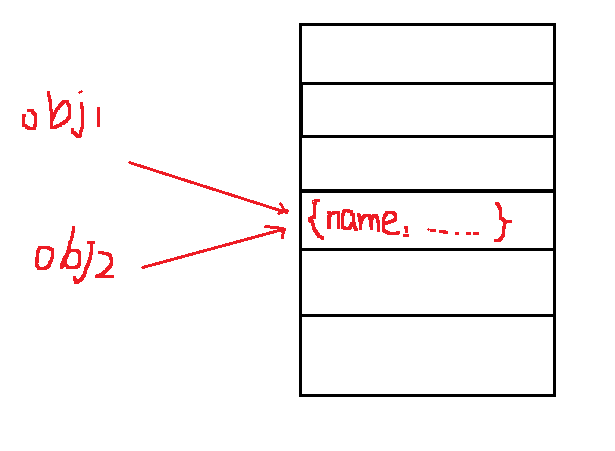

变量、作用域和内存
--------------

### 基本类型和引用类型的值

基本类型： `Undefined`, `Null`, `Boolean`, `Number`, `String`    
引用类型： `Object`       

基本类型是按值访问的可以操作保存在变量中的实际的值，操作引用类型( 对象 )的时候操作的其实是其引用而不是实际的对象。   

<hr />

**1. 动态的属性**

对于引用类型的值，可以为其添加属性、方法，也可以删除其属性和方法，但是对于基本类型，不能添加属性或者方法：
```javascript
const person = new Object();

person.name = "不会拉小提琴的左脚";
console.log(person.name); // 不会拉小提琴的左脚

const name = "不会拉小提琴的左脚";
name.age = 21;
name.getName = function() {
  console.log(name.age)
}

name.getName(); // Uncaught TypeError: name.getName is not a function
```

<hr />

**2. 复制变量值**

在从一个变量向另一个变量复制基本类型和引用类型的值的时候，也有区别，复制基本类型的值的时候，会在变量对象上创建一个新的值，然后把这个新的值赋值给新的变量，这样，两个变量虽然保存同样的值，但是互不干扰，修改一个不会影响另一个的值:
```javascript
let num1 = 15;
let num2 = num1;

num2 = 30;
console.log(num1); // 15 保持原来的值不变
console.log(num2); // 30 为修改以后的值
```
在内存中，二者也是占据两个内存单元，井水不犯河水。    
当给一个新的变量复制一个引用类型的值的时候，是将原来的引用复制一份然后赋值给新的变量，也就是说，之前保存这个值的变量是一个引用，或者说是一个指针，它指向保存这个值的地址，同样，新的变量同样指向这个地址，因此改变一个就会影响到另一个的值：
```javascript
const obj1 = { name: "不会拉小提琴的左脚", age:21 }
const obj2 = obj1;

obj2.age = 22;

console.log(obj1.age); // 22
console.log(obj2.age); // 22
```



<hr />

**3. 传递参数**

关于传递参数的详细内容，我写了一篇文章，[链接在这里](http://binghuixie.cn/2019/11/27/JavaScript%E5%8F%82%E6%95%B0%E4%BC%A0%E9%80%92-%E6%8C%89%E5%80%BC%E8%BF%98%E6%98%AF%E6%8C%89%E5%BC%95%E7%94%A8/)。

<hr />

**4. 类型检测**

JS 中可以用 typeof 运算符来检测类型，但是在检测 `null`, `object`, `array` 的时候返回的都是 object，所以需要一种更好的办法来检测类型：**instanceof**    
instanceof 操作符是用于检测某一变量是不是某种类型的实例，如果变量是给定引用类型的实例，那么 instanceof 操作符就会返回 true。可以用 instanceof 运算符检测变量是否是数组，对象，正则表达式等。   
除此之外，还可以使用 `toString()` 这个方法来检测类型，具体可以使用 `Object.prototype.toString.call(param)`：
```javascript
console.log(Object.prototype.toString.call(1)); // [object Number]
console.log(Object.prototype.toString.call(null)); // [object Null]
console.log(Object.prototype.toString.call({})); // [object Object]
console.log(Object.prototype.toString.call(function foo(){})); // [object Function]
console.log(Object.prototype.toString.call(undefined)); // [object Undefined]
```

<hr />

### 执行环境及作用域

关于执行环境，作用域，变量对象，作用域链这些功能，这里直接附上链接，是我看过的讲的最好的几篇文章：     
[ECMA-262-3 in detail. Chapter 1. Execution Contexts.](http://dmitrysoshnikov.com/ecmascript/chapter-1-execution-contexts/)
[ECMA-262-3 in detail. Chapter 2. Variable object.](http://dmitrysoshnikov.com/ecmascript/chapter-2-variable-object/)
[ECMA-262-3 in detail. Chapter 4. Scope chain.](http://dmitrysoshnikov.com/ecmascript/chapter-4-scope-chain/)

附上我自己的一片总结：
[JavaScript学习心得](http://binghuixie.cn/2019/02/21/JavaScript%E5%AD%A6%E4%B9%A0%E5%BF%83%E5%BE%97/)   

<hr />

### 垃圾收集

垃圾收集器会按照固定的时间间隔（或代码执行中预定的收集时间），周期性地找出那些不再继续使用的变量，然后释放其占用的内存。这就是 JavaScript 中的自动垃圾收集机制，具体到浏览器中的实现，通常有两种方法：   

**1. 标记清除**

标记清除是比较常用的一种垃圾回收的方法。总的来说，其机制是当变量进入环境的时候(如在函数内部或者全局作用域声明一个变量)，将其标记为 **“进入环境”**， 当变量离开环境时，将其标记为 **“离开环境”**。   
该算法将一些对象作为跟值(在 JavaScript 里面就是全局对象)，垃圾收集器将会从这些跟值开始，寻找与他们有关的值，再寻找和这些值有关的值，这样不断找下去，就会找到所有可以接触到的值，然后将不可以接触到的值收集起来，
进行清除(有一点类似深度优先算法)

**2. 引用计数**

跟踪每一个值被引用的次数，也就是说，如果有其他的变量对这个值进行的引用，那么这个值的引用次数就加一，如果某一个值的引用次数为 0 ，那么就清除掉。    
引用计数法有一个缺陷，就是当循环引用的时候，二者的引用次数永远都不会是 0 ，这样就会造成内存泄露：
```javascript
function referenceCounting() {
  const a = {};
  const b = {};
  a.x = b;
  b.y = a;
}
```
当上面这个函数运行完了以后，按道理说应该将其内部的变量也全部清除，但是因为 a 对象和 b 对象互相引用，他们的引用次数永远都是 1， 所以垃圾回收机制就不会把他们清除，如果 a 和 b 中存储了很大的数据，程序多次运行以后很可能就会造成内泄漏，
导致的反应就是浏览器运行速度变慢，占用内存变大。  

为了更好地管理内存，可以显示的解除不需要使用的变量的引用，如将其值设置为 null，这样，在下一次的垃圾收集器运行的时候就会将其回收，那么至于何时设置为 null， 这就需要程序员在写代码的时候自己决定了，当某一个变量例如在一个循环结束
或者条件判断结束或者全局环境的底部，都可以执行解除引用的操作。

相关链接：   
[MDN WEB DOCS: Memory Management](https://developer.mozilla.org/en-US/docs/Web/JavaScript/Memory_Management)    
[Garbage Collection Algorithm — Mark & Sweep](https://medium.com/@animeshgaitonde/garbage-collection-algorithm-mark-sweep-ed874272702d)